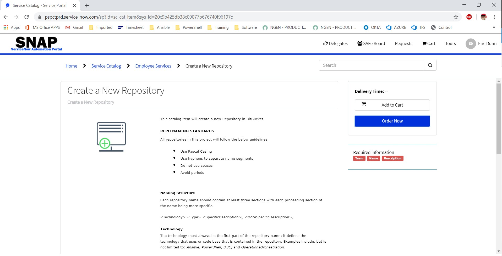
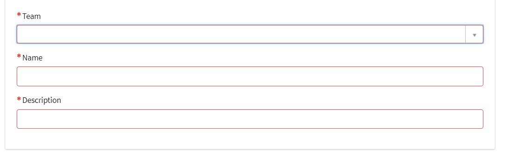
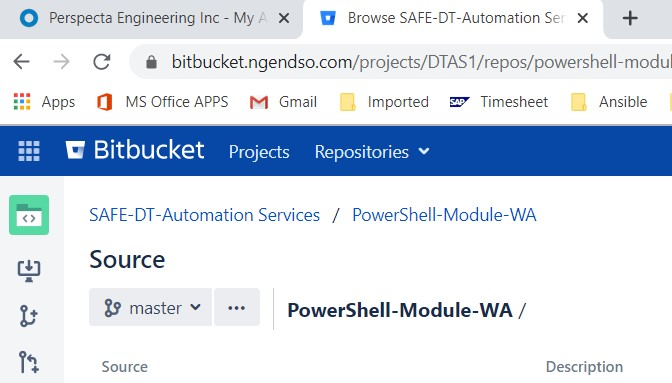
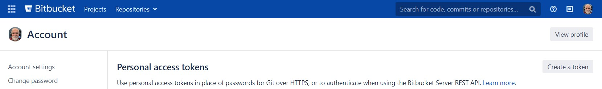
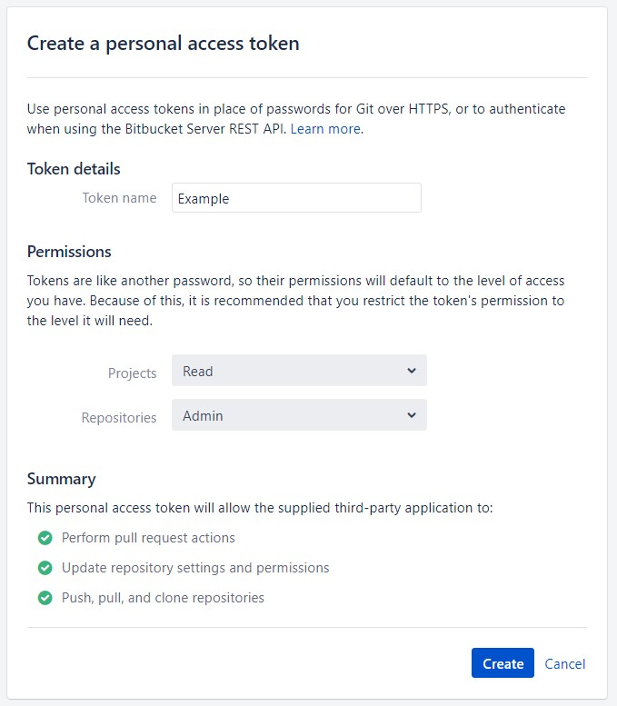
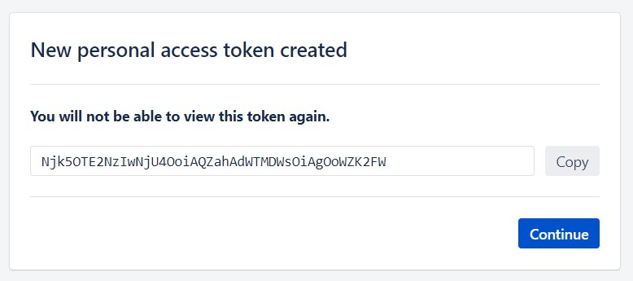
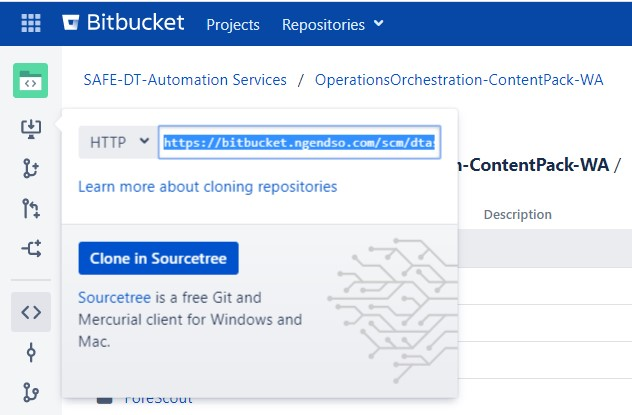
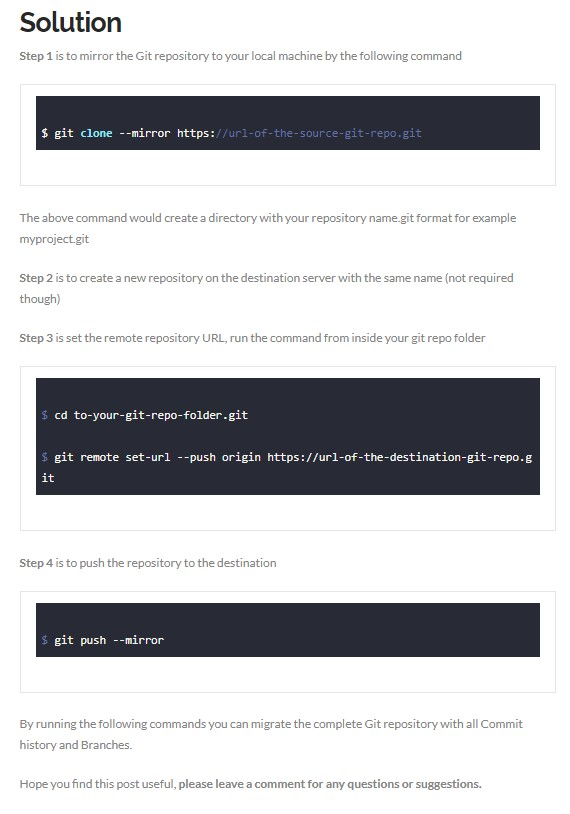
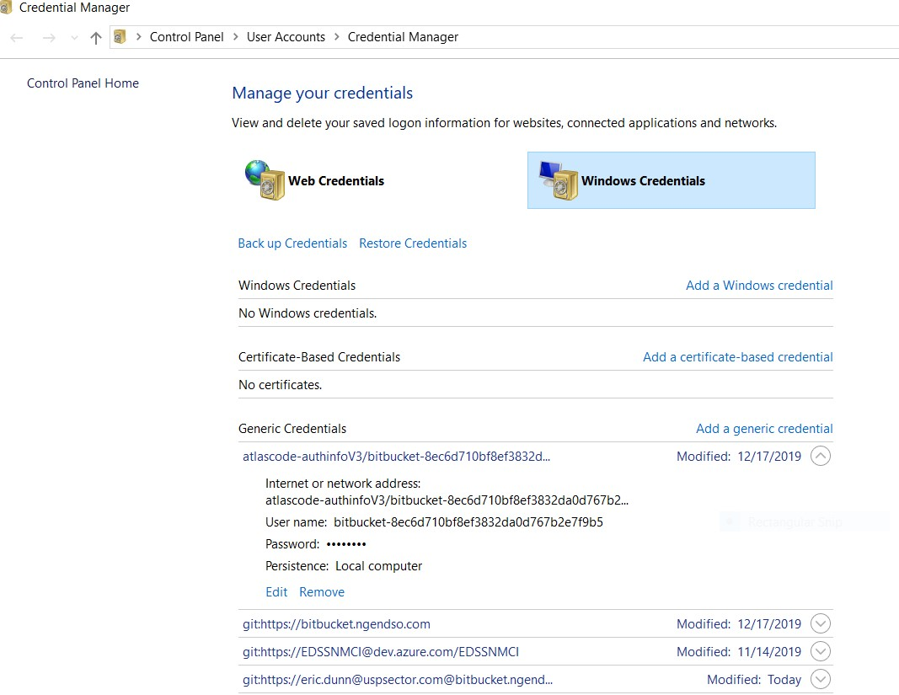

# How to Move Repositories from Azure to BitBucket

## Introduction

This document displays the process used to move repositories from Azure
to BitBucket.

## Instructions

### Create SNAP Request:

* Go to: <https://pspctprd.service-now.com/sp?sysparm_stack=no>
* Search for: "Create a New Repository"
* Create the “Order” in accordance with the posted instructions on the ServiceNow Automation Portal (SNAP) request.

> **NOTE**: The recommended name of the new Bitbucket repository (repos) should be the same as the Azure repository name.

* A Bitbucket repository will be created automatically from the SNAP request.
* Go to: [https://perspecta.okta.com/app/UserHome](https://perspecta.okta.com/app/UserHome)
* Click on the Bitbucket image/icon.

> *Optional*: Go directly to Bitbucket: [https://bitbucket.ngendso.com/dashboard](https://bitbucket.ngendso.com/dashboard)

### Migrate Azure Repository to Bitbucket repository

Clone Bitbucket repository to local machine to establish connection:

> **NOTE***: Before cloning new repository from Bitbucket you must create a **Personal Access Token** (PAT.)

* Go to [https://bitbucket.ngendso.com/plugins/servlet/access-tokens/manage](https://bitbucket.ngendso.com/plugins/servlet/access-tokens/manage)
* Click on “Create Token.”
* Fill out the Token Details and Permissions and then click **Create**

    > Projects = **Read**
    >
    > Repositores = **Admin**

> **NOTE: You will not be able to view this token again.**
>
> **COPY and SAVE the token someplace where you can retrieve for the following steps:**

* The token (alpha/numeric sequence) takes the place of the user’s credentials password.

> **NOTE**: The first time the git clone operation is performed:

* Create a **new local directory** to contain the migrated repository. This will avoid any issues if there is already a cloned repository with the same name.
* CD to the **new local directory.**
* Copy the Git Clone URL from Bitbucket.
* Go to: [https://bitbucket.ngendso.com/dashboard](https://bitbucket.ngendso.com/dashboard)
* Select "Projects" from the top bar.
* Select your project.
* Select your repository.
* Select the Clone Icon from the left (top icon.)
* Copy the provided URL.

* Run **git clone https://bitbucket.ngendso.com/scm/dtas1/YOUR-REPOSITORY.git** on the local machine.
* A prompt for credentials should appear.
* User Name = <user.name@uspsector.com>
* Password = token

> **IF THERE IS A PROBLEM** or a credentials prompt did not display, see the **Credentials Manager** instructions on last page of this document.

* **NOTE:** A credentials prompt may or may not be displayed for the next steps.

### Read the following article on [How to Migrate Git Repository with Branches and Commit History](https://datanextsolutions.com/blog/how-to-migrate-git-repository-with-branches-and-commit-history/)

* Open Git Bash in the root of the folder that contains all the repos (i.e. c:\\**new local directory**)
* Run the following Git commands
* $ **git clone --mirror https://url-of-the-source-git-repo.git**

> **NOTE***: (Source = Azure repository credentials may be required (Azure credentials - User + Token)

* $ cd to-your-source-git-repo-folder.git
* $ **git remote set-url --push origin https://url-of-the-destination-git-repo.git**

> **NOTE**: (Destination = Bitbucket. If Authentication fails, then run the command a second time and then the credentials prompt should display. Use Bitbucket credentials - User + Token.)

* $ **git push –mirror**

* Verify the new Bitbucket repository was populated with migrated code from Azure.

### Credentials Manager

* On the Windows Laptop, navigate to Start and search for **Credentials Manager**.
* When Credentials Manager is open, click on **Windows Credentials**.
* Find any …Bitbucket.ngendso.com… entry, click the arrow next to **entry**, and then remove the entry.

