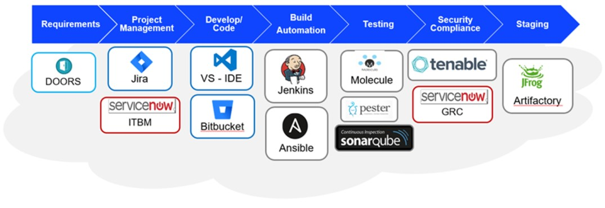

## Onboarding to Pipeline

***

### Pipeline Overview

#### DevSecOps pipeline tools

* You should be able to access below tools once you have you are added to ServiceNow groups and your pipeline account is created.
  * ServiceNow
  * Jira
  * Bitbucket
  * Jenkins
  * SonarQube
  * Artifactory

#### DevSecOps Tools Architecture

#### What is a Pipeline

* A pipeline in a Software Engineering team is a set of automated processes that allow Developers and DevOps professionals to reliably and efficiently compile, build and deploy their code to their production compute platforms.

#### What is a Bitbucket repository

* Revision control system. A repository is a data structure which stores **metadata for a set of files or directory structure**.

#### What is Jenkins

* Jenkins is an open source automation tool written in Java with plugins built for Continuous Integration purpose. Plugins allow the integration of Various DevOps stages. If you want to integrate a particular tool, you need to install the plugins for that tool.

#### What is a Webhook to Jenkins for Bitbucket

* A Webhook is a configurable and flexible hook for Bitbucket that notifies Jenkins about code commits, pull requests and merges.

#### What is linting

* Lint, or a Linter, is a tool that analyzes source code to flag programming errors, bugs, stylistic errors, and suspicious constructs.

  * Simply put, a linter is a tool that programmatically scans your code with the goal of finding issues that can lead to bugs or inconsistencies with code health and style. Some can even help fix them for you!

#### What are unit tests

* Unit tests are performed by the developer and are typically focused on the code they’ve just created or modified. They provide feedback that the code works as they wanted it to. Unit tests are done in isolation. By isolating the test to run on just the code they’ve written, and not that of external modules, they can be assured any problems they find are with their code and not with external modules or functions.

#### What is SonarQube

* SonarQube (formerly Sonar) is an open-source platform developed by SonarSource for continuous inspection of code quality to perform automatic reviews with static analysis of code to detect bugs, code smells, and security vulnerabilities on 20+ programming languages.

#### What is an Artifactory repository

* DevOps teams needs tools to efficiently manage an ever-growing matrix of **binaries**, environments and geographically distributed sites to ensure a smooth application development workflow. Artifactory provides a universal repository solution to host your **binaries and their metadata**.

#### What is an artifact

* A DevOps artifact is a by-product produced during the software development process. It may consist of the project source code, dependencies, binaries or resources, and could be represented in different layout depending on the technology.

***

### Creating Team, Users, Accessing pipeline tools

#### Complete the minimum [Udemy training](https://perspecta.udemy.com/organization/home/category/cicd-pipeline-on-boarding/) necessary for your role

#### Request for a SAFe Team (PO/Scrum Master can do this provided they have ServiceNow accounts with same roles)

* Go to: [Create a SAFe Team](https://pspctprd.servicenowservices.com/sp?id=sc_cat_item&sys_id=680ef992db64c41077b676740f961906&sysparm_category=003d5d6cdb8b730077b676740f961956&catalog_id=-1)

#### Request Pipeline Account

* Go to: [Create a Pipeline Account](https://pspctprd.servicenowservices.com/sp?id=sc_cat_item&sys_id=2bf9265ddb74809077b676740f9619c0&sysparm_category=003d5d6cdb8b730077b676740f961956&catalog_id=e0d08b13c3330100c8b837659bba8fb4) (this one requires the training)

* Prerequisite is to have a Perspecta/USPSector account with a valid email before submitting this request

* Go to: [How to Request Pipeline Accounts](https://pspctprd.servicenowservices.com/kb_view.do?sysparm_article=KB0012863)

#### Request ServiceNow group access (This is adding team members to the team)

* Go to: [Access to ServiceNow Group](https://pspctprd.servicenowservices.com/sp?id=sc_cat_item&sys_id=9dbbb419db4b3b0077b676740f9619fc&sysparm_category=e15706fc0a0a0aa7007fc21e1ab70c2f&catalog_id=-1)

#### Once Pipeline account is created you should be able to login to DevSecOps tools (these use the same Okta 2FA sign on process as "The Lens")

* Go to: [OKTA Portal](https://perspecta.okta.com/app/UserHome)

* If you do not see the pipeline tools on [OKTA Portal](https://perspecta.okta.com/app/UserHome) Please reach out to [Pipeline](mailto:ngendsopipelineteam@uspsector.com) team.

***

### Engineering your code through Pipeline

#### Create the necessary repositories

* Prerequisite is to have your team be present in both ServiceNow and Pipeline

* Go to: [Create a New Repository](https://pspctprd.servicenowservices.com/sp?id=sc_cat_item&sys_id=20c9b425db38c09077b676740f96197c&sysparm_category=003d5d6cdb8b730077b676740f961956&catalog_id=e0d08b13c3330100c8b837659bba8fb4)

  * Please read the instruction in the catalog item to follow repo naming standards

#### Once the repository is created, Engineering team members should configure their local GIT clients (VSCode, Visual Studio, GIT for windows, etc\... on their Perspecta seat) to use their BitBucket Repository.

* Go to: [How to Access Bitbucket Repositories](https://pspctprd.servicenowservices.com/kb_view.do?sysparm_article=KB0012868)

* If you are migrating your repositories from Azure, please use the below link for instructions.

* Go to: [Migrate Repos from Azure to Bitbucket](https://pspctprd.servicenowservices.com/kb_view.do?sysparm_article=KB0012864)

#### Configure Jenkins webhook in Bitbucket to trigger builds in Jenkins

* Go to: [How to Configure the Jenkins Webhook in Bitbucket](https://pspctprd.servicenowservices.com/kb_view.do?sysparm_article=KB0012865)

#### Create Jenkins pipeline for your repository in your team folder. This includes\...

* Creating a Jenkins multibranch pipeline (Refer to training to set it up for your team's needs).

* Creating a Jenkinsfile.

  * [Go to: Jenkinsfile Examples](https://pspctprd.servicenowservices.com/kb_view.do?sysparm_article=KB0012905)

  * A Jenkinsfile will contain steps do code analysis, unit testing, artifact generation, and to interact with SonarQube and Artifactory as needed.
    * Go to:  [How to configure linting (code analysis) in Jenkins](https://pspctprd.servicenowservices.com/kb_view.do?sysparm_article=KB0012912)
    * Go to:  [How to configure unit testing (pester) in Jenkins](https://pspctprd.servicenowservices.com/kb_view.do?sysparm_article=KB0012913)
    * Go to: [How to configure artifact generation in Jenkins](https://pspctprd.servicenowservices.com/kb_view.do?sysparm_article=KB0012918)
    * Go to:  [How to configure release (Jenkins/Artifactory)](https://pspctprd.service-now.com/kb_view.do?sysparm_article=KB0012916)
    * Go to:  [How to setup the pre/post Merge builds in Jenkins](https://pspctprd.servicenowservices.com/kb_view.do?sysparm_article=KB0012914)

***

### DevSecOps Pipeline Demo with “Hello World”

[Please find the below attached video with this document or click on this link](https://pspctprd.servicenowservices.com/sys_attachment.do?sys_id=059bec9a1b0f0c102c60a759bc4bcb4e)
